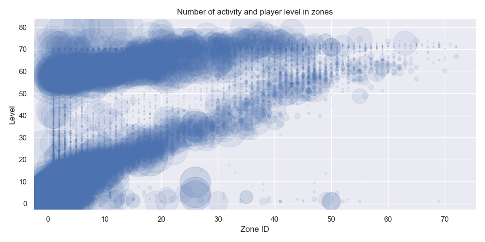
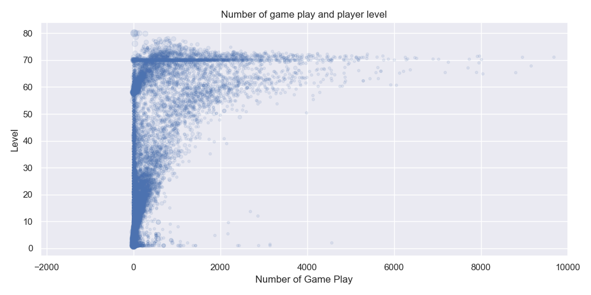
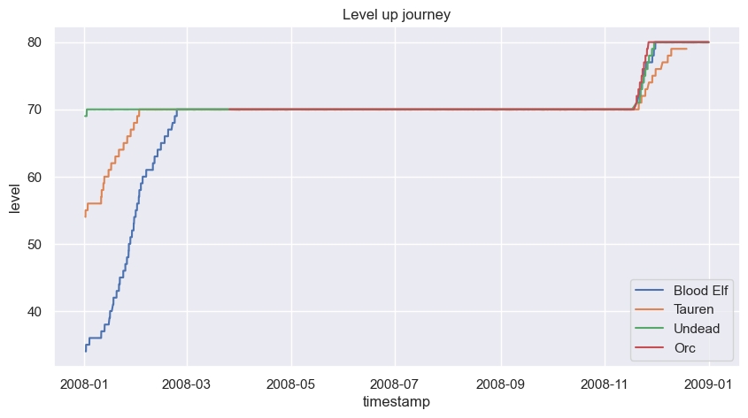
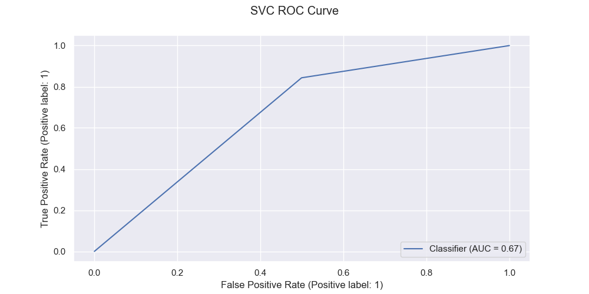

# World of Warcraft 

## 1. Objective Predict Game Player Churn

`Classify game player who is likely to be churned in six month`

    The experiment aims to prevent game players from quitting within a month by offering them a discounted 6-month subscription.

Predicting game player churn is an important problem in the gaming industry as it helps game developers and publishers understand the behavior of their players and take necessary steps to retain them. By analyzing the pattern of players before they churn, game developers can take proactive measures to retain their players and prevent them from quitting the game.

## 2. Data source

- Kaggle ([World of Warcraft Avatar History](https://www.kaggle.com/datasets/mylesoneill/warcraft-avatar-history?resource=download) | Kaggle)

The techniques you expect to use in your analysis

- Use Classification estimator and conduct hyperparameters optimization.
- Operationalize the model as Rest API

## 3. Exploratory Data Analysis

Details [EDA Notebook](./WW-EDA.ipynb)

Data has 27,681 game players information

### Game player's character level

- Level 70 was maximum cap before November 2008 which explain why there are many activity of level 70

### Races in game

- Blood Elf is the most popular race in the game

### Level by Race

- In November, the maxium level was increase to 80, many palyers back to play to reach the level to 80
- Except Blood Elf, most of races show similar trend

### Character Classes

### Guild

- `-1` indicate no guild, never join any guild
- Guild `103` is the most popular and `282` is second

## 4. Business Findings

Number of guild activity and game play

- Low level gamers move guild often than high level gamers
- High level gamers change guild less than 5 times a year

### Subscription model

World of Warcraft (WoW) offers 3 diffenent subscriptions

    - 1 month, $ 14.99/month
    - 3 months, $ 13.99/month
    - 6 months, $ 12.99/month

    Free trial up to level 20

### Period of playing game in months

- 55.2 % of player drop after a month of game play
- When the gamer pass 8 months, they might play to 4 or more
- 13-months mean that the gamer played the game since January to December, the first month counts a 1

### Number of players by period of playing by race

### New players

- Every month there are more than 1,000 of new players (or new characters)
- In October there was new update and it caused new character Orc and Troll races

### Level activity

- When the gamer reaches level 60+, number of zone for game play reduced

### Game play and level

- Game players who played the game 12 months or more show more activity for both game play and guild

- Player level up journey

## 5. Training

Details [Experiment Notebook](./WW-Experiments.ipynb)

### Classification Baseline models

|Estimator|training(sec)|Train Score|Test Score|Precision|Recall|
|-|-|-|-|-|-|
|Logistic Regression|0.07|0.68|0.68|0.61|0.65|
|Decision Tree|0.04|0.99|0.66|0.59|0.61|
|KNeighbors|0.01|0.77|0.66|0.60|0.56|
|SVC|1.39|0.63|0.63|0.54|0.85|
|RandomForest|0.57|0.99|0.71|0.66|0.64|

### RoC Curve

RandomFroest shows the best result among the estimators

### Hyperparameter Tuning

Logistic Regression

    Best hyperparameters: {'estimator__C': 10, 'estimator__penalty': 'l1', 'estimator__solver': 'liblinear'}
    Test set accuracy: 0.72

RandomFroest

    Best hyperparameters: {'estimator__max_depth': 7, 'estimator__max_features': 'sqrt', 'estimator__min_samples_leaf': 3, 'estimator__min_samples_split': 2, 'estimator__n_estimators': 50}
    Test set accuracy: 0.7397525135344161

## Next step

### Action items

Use regression estimator to predict game play preiod

[Use ML Interprt to understand festure importance](./WW-InterpretModels.ipynb)
